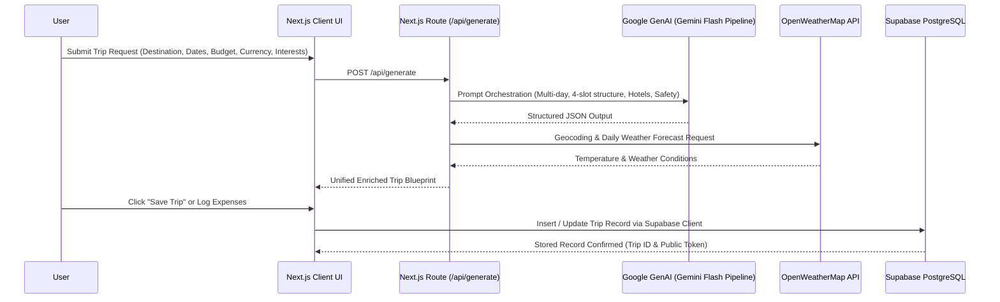

# 🏗️ Wanderly Architecture & System Design

This document details the architecture, data flow, component design, and integration patterns powering **Wanderly** — an advisor-grade AI travel planning application.

---

## 🎨 System Overview

Wanderly combines **Next.js 16 (App Router)**, **Google Gemini GenAI**, **Supabase (Auth & PostgreSQL)**, **Leaflet Geo-mapping**, and **OpenWeatherMap** into a unified, responsive travel management platform.

### High-Level Data Flow



---

## 🏛️ Subsystems & Components

```mermaid
graph TD
    subgraph Frontend Layer
        A[Next.js App Router]
        B[TripForm / AdvancedItinerary]
        C[TripMap - Leaflet & React-Leaflet]
        D[ExpenseTracker & BudgetChart]
        E[ShareTrip & QR Code Generator]
        F[ExportPDF & ICS Calendar Exporter]
    end

    subgraph Backend & Services
        G[/api/generate API Route]
        H[Google GenAI SDK - Multi-model Fallback]
        I[OpenWeatherMap API]
        J[Supabase Client SDK]
    end

    subgraph Data & Persistence
        K[(Supabase PostgreSQL)]
        L[Supabase Auth & Session Storage]
    end

    A --> B & C & D & E & F
    B --> G
    G --> H & I
    B & D & E --> J
    J --> K & L
```

---

## 🛠️ Deep-Dive into Core Subsystems

### 1. AI Generation Engine (`src/app/api/generate/route.ts`)
- **Strict Schema Enforcement**: Directs Gemini to produce a strict JSON document containing:
  - Exact $N$-day itinerary elements matching the start and end dates.
  - 4 distinct slots per day (`morning`, `afternoon`, `evening`, `night`) with geographic coordinates (`lat`, `lng`), activities, and transport suggestions.
  - 3-tier hotel recommendations (`Budget`, `Mid-Range`, `Luxury`) with nightly prices and ratings.
  - Destination safety evaluation (`safe`, `caution`, `unsafe`) and emergency contact directories.
  - Seasonal weather summary and clothing/packing checklists.
- **Model Fallback Pipeline**:
  To ensure uninterrupted availability, requests cycle through candidate models:
  `gemini-3.6-flash` $\rightarrow$ `gemini-2.5-flash` $\rightarrow$ `gemini-1.5-flash` $\rightarrow$ `gemini-2.0-flash`.
- **Weather Enrichment**: Queries OpenWeatherMap using geocoded destination coordinates and enriches individual days with real forecast data.

---

### 2. Database & Data Access Layer (`src/lib/db.ts` & `src/lib/supabase.ts`)
- **Cloud Database (Supabase PostgreSQL)**:
  - Centralized schema for trip records: destination, dates, day count, budget, currency, itinerary slots, hotels, expenses, public tokens, and visibility flags.
- **Bi-directional Mappers**:
  - `mapToDb`: Converts camelCase TypeScript interface (`TripData`) to snake_case PostgreSQL schema (`user_id`, `start_date`, `cost_breakdown`, `public_token`, etc.).
  - `mapFromDb`: Deserializes database rows back into typed client-side models.
- **Authentication**:
  - Email/Password registration with confirmation email redirects (`/auth/callback`).
  - Session state managed via `AuthProvider` React Context.

---

### 3. Interactive Geo-Mapping Subsystem (`src/components/TripMap.tsx`)
- **Leaflet & React-Leaflet**:
  - Renders interactive OpenStreetMap tiles with custom markers.
  - **Gold Pin**: Accommodations with nightly rates, ratings, and descriptions.
  - **Forest Green Pin**: Daily activities with schedule labels (e.g., "Morning (Day 1)").
  - **FitBounds Hook**: Computes geographic bounding boxes dynamically across all coordinates for auto-centering.
  - **Security Zone Overlay**: Displays caution or critical alert banners if destination safety levels indicate potential risks.

---

### 4. Financial & Expense Tracking Engine
- **Multi-Currency System (`src/lib/currency.ts`)**:
  - Supports INR, USD, EUR, GBP, AED, and JPY.
  - Currency conversion utilities, formatting via `Intl.NumberFormat`, and dedicated `/currency` utility page.
- **Live Expense Tracker (`src/components/ExpenseTracker.tsx`)**:
  - Allows users to log itemized expenses by category: `hotel`, `food`, `transport`, `activity`, `shopping`, and `other`.
  - Calculates live budget utilization percentage, remaining balance, and over-budget delta.
  - Persists directly to the Supabase trip record.
- **Budget Visualization (`src/components/BudgetChart.tsx`)**:
  - Responsive doughnut chart powered by Chart.js displaying estimated vs. category allocations.

---

### 5. Collaboration & Sharing (`src/components/ShareTrip.tsx`)
- **Public Trip Sharing**:
  - Generates secure random UUID tokens for public trip viewing.
  - Read-only shared view route (`/shared-trip/[token]`) enabling anyone with the link to view the complete schedule without an account.
- **Dynamic QR Code Generation**:
  - Uses `qrcode.react` with SVG rendering for fast mobile scanning.
- **Privacy Controls**:
  - Users can enable, disable, or regenerate public access tokens at any time.

---

### 6. Document & Schedule Exporters
- **Pro PDF Generator (`src/components/ExportPDF.tsx`)**:
  - Generates downloadable travel blueprints using `jspdf` and `jspdf-autotable`.
  - Formats destination info, hotel options, daily itineraries, weather predictions, and emergency protocols into a high-res printable PDF.
- **Calendar Sync (.ics) (`src/components/AdvancedItinerary.tsx`)**:
  - Utilizes `ics` library to bundle all itinerary slots into standardized iCalendar events.
  - Instantly importable into Google Calendar, Apple Calendar, and Outlook.

---

## 🔐 Security & Privacy

1. **Server-Side API Key Protection**: `GEMINI_API_KEY` and `OPENWEATHER_API_KEY` are kept strictly in server runtime environments.
2. **Access Control**: Database queries are scoped to the authenticated `user_id`, while public access is restricted strictly to trips where `is_public = true` matching the exact `public_token`.
3. **Input Sanitization & Validations**: Form constraints validate arrival/departure date chronology, minimum group sizes, and budget constraints before AI dispatch.

