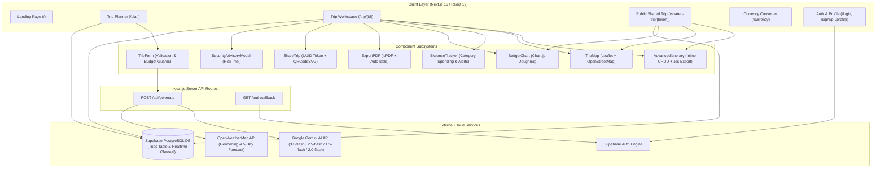
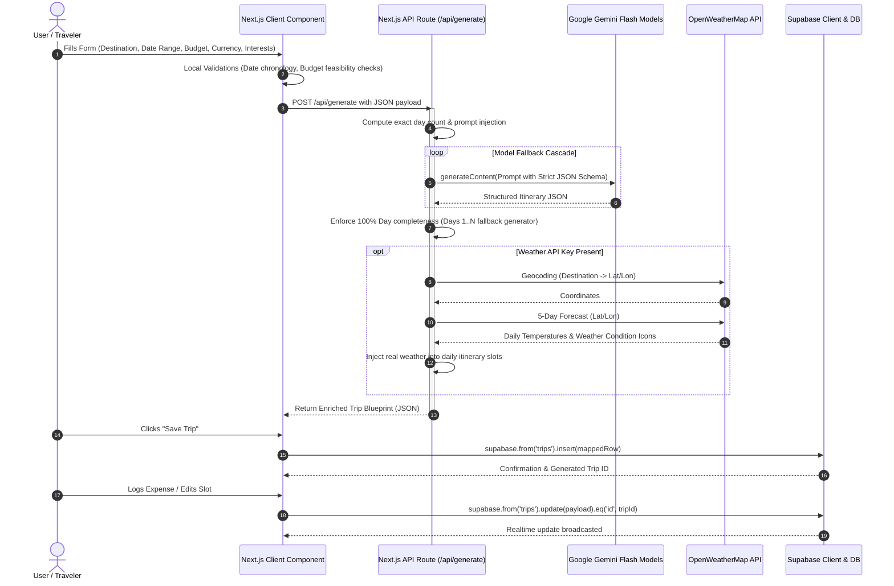
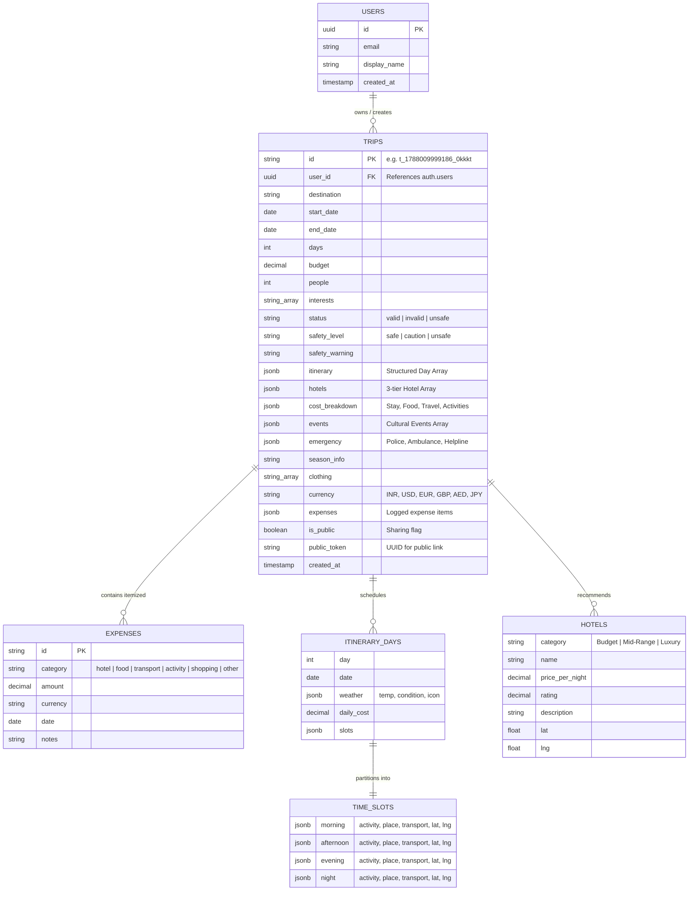

# 🏆 SIH Student Innovation Project Analysis: Wanderly AI Travel Planner

---

## 1. Project Overview & Problem Statement

### 📌 Project Synopsis
**Wanderly** is an advisor-grade, full-stack AI travel curation and itinerary management platform built with **Next.js 16 (Turbopack)**, **Google Gemini GenAI**, **Supabase (PostgreSQL & Auth)**, **Leaflet Geo-mapping**, and **OpenWeatherMap**. It transforms high-level user travel constraints (destination, date window, budget, party size, currency, and interest tags) into actionable, time-slotted daily itineraries enriched with live weather forecasts, verified accommodation recommendations, regional safety advisories, and financial management tools.

```
                    ┌─────────────────────────────────────────────────────────┐
                    │               WANDERLY CORE PROPOSITION                │
                    │   Input: Destination + Dates + Budget + Interests       │
                    │   Output: Day-by-Day 4-Slot Schedule + Geo-Map +        │
                    │           Expense Tracker + PDF/ICS + Live Weather      │
                    └─────────────────────────────────────────────────────────┘
```

### ❗ Problem Statement
Modern tourism planning suffers from severe **context fragmentation** and **information overload**:
1. **Tool Dispersal**: Travelers juggle 5–8 separate applications (Google Maps for routing, Excel for budgets, TripAdvisor for reviews, booking engines, weather apps, and messaging apps to share plans).
2. **Generic Recommendations**: Traditional travel blogs and static tour packages fail to account for group dynamics, tight budgets, travel dates, or specific traveler interests.
3. **Safety & Emergency Blindspots**: Tourists often travel without immediate access to localized emergency hotlines (Police, Ambulance, Helpline), security risk tiers, or climate-appropriate packing guidance.
4. **Expense Leakage**: Lack of integrated, multi-currency budget logging leads to budget overruns during active travel.
5. **Collaboration Friction**: Sharing itineraries with travel companions is typically done via static screenshots rather than interactive, responsive web interfaces.

---

## 2. Complete Technology Stack

| Layer | Technology | Version | Exact Role & Codebase Evidence |
|---|---|---|---|
| **Core Framework** | Next.js (App Router, Turbopack) | `16.2.3` | Hybrid Server/Client rendering, dynamic routing (`src/app/`) |
| **Frontend Runtime** | React & React DOM | `19.2.4` | Modern component tree with Server/Client boundary separation |
| **Styling & Design System** | Tailwind CSS & PostCSS | `^4.0` | Utility styling, custom CSS tokens (`src/app/globals.css`) |
| **Generative AI** | `@google/genai` (Google GenAI SDK) | `^1.49.0` | Multi-model fallback cascade (`src/app/api/generate/route.ts`) |
| **Database & Backend** | `@supabase/supabase-js` | `^2.112.4` | PostgreSQL cloud persistence & Auth (`src/lib/supabase.ts`, `src/lib/db.ts`) |
| **Interactive Mapping** | Leaflet & `react-leaflet` | `^1.9.4` / `^5.0.0` | Geo-spatial visualization & custom pins (`src/components/TripMap.tsx`) |
| **Weather Intelligence** | OpenWeatherMap API | REST API | Geocoding & 5-day daily forecast (`src/lib/weather.ts`) |
| **Data Visualization** | Chart.js & `react-chartjs-2` | `^4.5.1` / `^5.3.1` | Budget allocation doughnut charts (`src/components/BudgetChart.tsx`) |
| **Calendar Synchronization** | `ics` | `^3.12.0` | RFC-5545 `.ics` iCalendar generator (`src/components/AdvancedItinerary.tsx`) |
| **Document Generation** | `jspdf` & `jspdf-autotable` | `^4.2.1` / `^5.0.7` | Client-side formatted PDF generator (`src/components/ExportPDF.tsx`) |
| **QR Code Engine** | `qrcode.react` | `^4.2.0` | SVG-based dynamic QR generator (`src/components/ShareTrip.tsx`) |
| **String Compression** | `lz-string` | `^1.5.0` | Client compression utility (`package.json`) |
| **Icons & Visuals** | `lucide-react` | `^1.8.0` | Consistent UI icon set across all views |
| **Date Processing** | `date-fns` | `^4.1.0` | Date arithmetic and formatting |

---

## 3. Existing Features Analysis

| Feature | Status | Codebase Location | Implementation Details |
|---|---|---|---|
| **AI Day-by-Day Itinerary** | ✅ **Implemented** | `src/app/api/generate/route.ts` | Generates exact $N$-day itineraries based on start and end dates with time slots. |
| **4-Slot Daily Breakdown** | ✅ **Implemented** | `src/components/AdvancedItinerary.tsx` | Morning, Afternoon, Evening, and Night time slots with activity, venue, transit, and geo-coords. |
| **Multi-Model AI Fallbacks** | ✅ **Implemented** | `src/app/api/generate/route.ts:108-135` | Cascades across `gemini-3.6-flash` $\rightarrow$ `gemini-2.5-flash` $\rightarrow$ `gemini-1.5-flash` $\rightarrow$ `gemini-2.0-flash`. |
| **Interactive Geo-Mapping** | ✅ **Implemented** | `src/components/TripMap.tsx` | Leaflet map with gold hotel pins, green activity pins, popups, and dynamic bounding box auto-fit. |
| **3-Tier Hotel Scout** | ✅ **Implemented** | `src/components/HotelGrid.tsx` | Recommends Budget, Mid-Range, and Luxury accommodations with ratings, prices, and descriptions. |
| **Security Advisory System** | ✅ **Implemented** | `src/components/SecurityAdvisoryModal.tsx` | Safety classification (`safe`, `caution`, `unsafe`) with interactive risk modals and map badges. |
| **Emergency Directory** | ✅ **Implemented** | `src/components/QuickInfoSection.tsx` | Displays destination Police, Ambulance, and Tourist Helpline hotlines. |
| **Live Weather Integration** | ✅ **Implemented** | `src/lib/weather.ts` | Geocodes destination and injects real-time OpenWeatherMap temperature and weather icons. |
| **Inline Itinerary Editing** | ✅ **Implemented** | `src/components/AdvancedItinerary.tsx` | Add, modify, or delete specific slot activities with instant Supabase update sync. |
| **Calendar Sync (.ics)** | ✅ **Implemented** | `src/components/AdvancedItinerary.tsx` | One-click export of the entire multi-day schedule into Google/Apple/Outlook calendars. |
| **Pro PDF Export** | ✅ **Implemented** | `src/components/ExportPDF.tsx` | Multi-page PDF generator containing full itineraries, hotels, weather, and emergency info. |
| **Multi-Currency System** | ✅ **Implemented** | `src/lib/currency.ts` | Supports INR, USD, EUR, GBP, AED, and JPY with conversion utilities. |
| **Standalone Currency Tool** | ✅ **Implemented** | `src/app/currency/page.tsx` | Dedicated currency converter page with currency swap and live calculation. |
| **Live Expense Tracker** | ✅ **Implemented** | `src/components/ExpenseTracker.tsx` | Category-based expense logging (Hotel, Food, Transport, etc.) with real-time budget progress & warnings. |
| **Budget Charting** | ✅ **Implemented** | `src/components/BudgetChart.tsx` | Responsive doughnut chart visualization using Chart.js. |
| **Public Sharing & QR Codes** | ✅ **Implemented** | `src/components/ShareTrip.tsx`, `src/app/shared-trip/[token]/` | Generates secure UUID public tokens, QR codes, and read-only shared trip pages. |
| **Cloud Auth & Profiles** | ✅ **Implemented** | `src/components/AuthProvider.tsx`, `src/app/login/`, `signup/`, `profile/` | Supabase email/password authentication, session listeners, and profile management. |
| **Database Realtime Sync** | 🟡 **Partial** | `src/app/trip/[id]/page.tsx:81-96` | Subscribes to Supabase `postgres_changes`, but lacks multi-user collaborative presence/cursor locking. |
| **Live OTA Booking Engine** | ❌ **Missing** | `src/components/HotelGrid.tsx` | Hotel cards direct to Google Search queries rather than real-time GDS/OTA booking APIs (e.g., Amadeus, Booking.com). |
| **Offline PWA Support** | ❌ **Missing** | `package.json` | `lz-string` exists, but no Service Worker or Web App Manifest is configured for full offline caching. |

---

## 4. System Architecture Diagram



---

## 5. Frontend–Backend–AI–Supabase Data-Flow Diagram



---

## 6. Complete User Flowchart

```mermaid
flowchart TD
    Start([User Arrives at Wanderly]) --> AuthCheck{User Logged In?}
    
    AuthCheck -- No --> BrowseOrAuth{Action?}
    BrowseOrAuth -- Browse Landing --> Hero[Explore Features & Demo]
    BrowseOrAuth -- Auth --> AuthFlow[Login / Signup / Email Confirmation]
    AuthFlow --> Dashboard[User Dashboard /dashboard]
    
    AuthCheck -- Yes --> Dashboard
    
    Hero --> PlanCTA[Click 'Start Planning']
    Dashboard --> PlanCTA
    
    PlanCTA --> FillForm[Fill Trip Parameters: Destination, Dates, Budget, Currency, Interests]
    FillForm --> ValidateForm{Form Valid?}
    
    ValidateForm -- Errors (Past Date / Low Budget) --> ShowWarning[Show Inline Validation Warning]
    ShowWarning --> FillForm
    
    ValidateForm -- Valid --> SubmitGen[Submit Generation Request]
    SubmitGen --> LoadingState[Show Animated Security & Scouter Progress Steps]
    
    LoadingState --> ResultView[Display Generated Plan]
    
    ResultView --> SafetyCheck{Safety Level?}
    SafetyCheck -- Unsafe / Caution --> TriggerModal[Auto-trigger Security Advisory Modal]
    SafetyCheck -- Safe --> ActionChoices
    TriggerModal --> ActionChoices{User Actions}
    
    ActionChoices --> SaveTripAction[Save Trip to Supabase DB]
    ActionChoices --> EditSchedule[Inline Edit / Delete Activities]
    ActionChoices --> MapExplore[Explore Interactive Leaflet Map & Navigation]
    ActionChoices --> ExportActions[Export Blueprint]
    ActionChoices --> ExpenseAction[Log Actual Expenses & View Doughnut Chart]
    ActionChoices --> ShareAction[Generate Public Link & Dynamic QR Code]
    
    ExportActions --> ExportPDF[Download High-Res PDF]
    ExportActions --> ExportICS[Sync to Google/Apple/Outlook Calendar]
    
    ShareAction --> PublicLink[Share `/shared-trip/[token]` with Companions]
    PublicLink --> CompanionView[Companions View Read-Only Interactive Plan]
```

---

## 7. Trip-Generation Flowchart

```mermaid
flowchart TD
    A[Client submits payload to /api/generate] --> B[Parse parameters: destination, startDate, endDate, budget, people, currency, interests]
    B --> C[Calculate exact duration: diffDays = round endUtc - startUtc + 1]
    C --> D[Construct System Prompt with strict JSON Schema and exact day slots]
    
    D --> E[Initialize GoogleGenAI SDK with GEMINI_API_KEY]
    E --> F[Initialize candidate models list: gemini-3.6-flash, 2.5-flash, 1.5-flash, 2.0-flash]
    
    F --> G{Attempt Candidate Model}
    G -- Success --> H[Extract Text Output]
    G -- Rate Limit / Error --> I{More Models in List?}
    I -- Yes --> G
    I -- No --> J[Return 500 Generation Failure Error]
    
    H --> K[Regex Extract JSON Object: match /\{[\s\S]*\}/]
    K --> L{Valid JSON parsed?}
    L -- No --> J
    L -- Yes --> M[Itinerary Completeness Loop: Verify Days 1 to N exist]
    
    M --> N{Any Day Missing or Incomplete?}
    N -- Yes --> O[Inject deterministic fallback slot template for missing day]
    N -- No --> P[Completed 4-Slot Day-by-Day Array]
    O --> P
    
    P --> Q{OPENWEATHER_API_KEY Available?}
    Q -- Yes --> R[Fetch Geocoordinates for destination]
    R --> S[Fetch 5-day daily forecast matching dates]
    S --> T[Enrich itinerary objects with temp, condition, icon]
    Q -- No --> U[Retain AI estimated weather]
    T --> V[Return JSON Response with 200 OK]
    U --> V
```

---

## 8. Database / Entity-Relationship (ER) Diagram



---

## 9. API / Backend Architecture Overview

Wanderly utilizes Next.js Server Route Handlers and Supabase Data Access Objects to achieve separation of concerns:

```
src/
├── app/api/generate/route.ts   --> Server-side AI & Weather orchestration
├── lib/db.ts                   --> Repository Pattern over Supabase Client
├── lib/supabase.ts             --> Supabase Client Initialization & Config
├── lib/weather.ts              --> OpenWeatherMap Integration Module
└── lib/currency.ts             --> Currency Conversion & Formatter Utilities
```

### Key API Handlers & Methods

#### 1. `POST /api/generate` (`src/app/api/generate/route.ts`)
- **Purpose**: Generates an AI-curated travel plan and enriches it with weather data.
- **Request Body**:
  ```json
  {
    "destination": "Goa, India",
    "startDate": "2026-09-10",
    "endDate": "2026-09-13",
    "budget": 35000,
    "people": 2,
    "currency": "INR",
    "interests": ["relaxation", "food"]
  }
  ```
- **Response**: Full `TripData` JSON containing `itinerary`, `hotels`, `cost_breakdown`, `emergency`, `season_info`, `clothing`, and `safety_level`.

#### 2. Supabase DAO Layer (`src/lib/db.ts`)
- `saveTrip(trip: TripData): Promise<string>` — Inserts a trip record into PostgreSQL via `mapToDb()`.
- `updateTrip(tripId: string, updates: Partial<TripData>): Promise<boolean>` — Executes dynamic column updates.
- `getUserTrips(userId: string): Promise<TripData[]>` — Fetches all trips belonging to the authenticated user ordered by `created_at DESC`.
- `deleteTrip(tripId: string): Promise<boolean>` — Removes a trip record.
- `getPublicTrip(token: string): Promise<TripData | null>` — Securely retrieves a trip only when `is_public = true` matching the specific `public_token`.

---

## 10. AI Implementation Analysis

### 🎯 Prompt Engineering Strengths
1. **Persona Anchor**: Prompts the AI as an *"elite Travel Itinerary Architect and Security Analyst"*.
2. **Schema Invariant**: Specifies exact required output keys, nested object formats, coordinate keys (`lat`, `lng`), and 3 hotel categories (`Budget`, `Mid-Range`, `Luxury`).
3. **Slot Partitioning**: Explicitly forces 4 distinct time slots per day (`morning`, `afternoon`, `evening`, `night`) to eliminate vague, hand-wavy suggestions.
4. **Fallback Model Cascade**: Iterates sequentially through candidate models:
   ```typescript
   const candidateModels = [
     "gemini-3.6-flash",
     "gemini-2.5-flash",
     "gemini-1.5-flash",
     "gemini-2.0-flash",
   ];
   ```
   If any model triggers rate limits (HTTP 429) or regional outages, the system automatically falls back to the next model.
5. **Deterministic Missing Day Recovery**: If the AI response truncates mid-stream on longer 7–10 day trips, the server loop in `route.ts:153-186` detects missing days and injects structured placeholder slots to prevent UI crashes.

### ⚠️ AI Limitations & Vulnerabilities
1. **Prompt Injection Surface**: The destination and interest strings are concatenated directly into the prompt string without semantic sanitization. Malicious inputs could attempt prompt escape.
2. **Coordinate Hallucination**: While Gemini provides latitude/longitude floats, these are approximations and not verified against a live Google Places / Mapbox Geocoding API.
3. **Budget Static Ratio Allocation**: The prompt defaults to static percentage estimates (40% stay, 25% food, 15% travel, 20% activities) which may diverge in hyper-expensive or remote travel destinations.

---

## 11. Security & Privacy Analysis

| Security Vector | Current State | Codebase Reality & Evaluation |
|---|---|---|
| **AI Key Protection** | 🟢 **Secure** | `GEMINI_API_KEY` is accessed exclusively in server-side `src/app/api/generate/route.ts`. Never exposed to the browser bundle. |
| **Weather Key Protection** | 🟢 **Secure** | `OPENWEATHER_API_KEY` is executed exclusively on the server in `src/lib/weather.ts`. |
| **Public Sharing Security** | 🟢 **Secure** | Trips are not queryable by predictable IDs. Sharing requires a cryptographically random UUID `public_token` and `is_public === true`. |
| **Row Level Security (RLS)** | 🟡 **Needs Hardening** | Client-side queries use `supabase.from('trips')`. Supabase database policies must enforce `auth.uid() = user_id` for reads/writes and `is_public = true` for token reads. |
| **Auth Redirect Security** | 🟢 **Secure** | Supabase email redirects are bounded to `AUTH_REDIRECT_URL = ${SITE_URL}/auth/callback`. |
| **Input Sanitization** | 🟡 **Basic** | Basic date and number clamping exist in `TripForm.tsx`, but raw text inputs lack sanitization against script/markup injection. |

---

## 12. Current Bugs, Limitations, and Technical Debt

1. **Leaflet SSR Incompatibility (Fixed via Dynamic Imports)**: Leaflet requires window-level objects. The codebase correctly uses `dynamic(() => import(...), { ssr: false })` in `plan/page.tsx` and `trip/[id]/page.tsx`.
2. **Unverified Hotel Coordinates & Links**: Hotels in `HotelGrid.tsx` generate external Google search URLs (`https://www.google.com/search?q=...`) rather than real-time room availability, live rates, or direct affiliate booking links.
3. **Hardcoded Currency Exchange Matrix**: `src/lib/currency.ts` uses static exchange rates (`EXCHANGE_RATES: Record<string, number> = { INR: 1, USD: 0.012, EUR: 0.011... }`). Real-world rates fluctuate daily and require an external live rates API (e.g., Open Exchange Rates).
4. **Weather Forecast Range Limit**: The free OpenWeatherMap 5-day / 3-hour forecast only supports dates within the upcoming 5 days. For trips planned weeks or months in advance, real-time forecast data returns `null` and falls back to AI season descriptions.
5. **No PWA / Offline Service Worker**: Travelers in low-connectivity areas (flights, remote mountains) cannot view cached itineraries offline unless they previously generated a PDF.

---

## 13. UI/UX Analysis

### 🌟 Strengths
- **Cohesive Design System**: Built on warm, organic earth tones defined in `src/app/globals.css` (`--cream: #FAF8F5`, `--forest: #1E3A2F`, `--sand: #E8E2D5`, `--charcoal: #1C1917`).
- **Clear Information Hierarchy**: The trip detail workspace divides dense data into intuitive sections: Quick Stats $\rightarrow$ Safety Intel $\rightarrow$ Interactive Map $\rightarrow$ Day-by-Day Schedule $\rightarrow$ Hotel Cards $\rightarrow$ Expense Tracker.
- **Dynamic Micro-Interactions**: Loading states display real-time animated status steps (*"Scouting verified accommodations...", "Checking local climate patterns..."*).
- **Proactive Validation UI**: `TripForm.tsx` provides live feedback if dates are in the past, departure precedes arrival, or the entered budget is unrealistically low for the selected duration.

### ⚠️ UX Improvement Areas
- **Mobile Sticky Navigation**: When scrolling through a 10-day itinerary, quick jumps between days would benefit from a sticky sub-navigation pill bar.
- **Dark Mode**: Currently tailored to light/cream theme; a true dark mode toggle would enhance nighttime traveler use.

---

## 14. SIH Tourism Evaluation Matrix

| Evaluation Dimension | Score (/10) | Comprehensive Justification |
|---|:---:|---|
| **1. Innovation & Novelty** | **9.0 / 10** | Unifies AI schedule planning with real-world security advisory alerts, Leaflet geo-routing, live weather enrichment, and dynamic multi-currency expense logging into one single interface. |
| **2. Real-World Impact** | **9.5 / 10** | Solves major pain points for domestic and international tourists: fragmented tools, unplanned budget overruns, emergency helpline accessibility, and companion collaboration. |
| **3. Technical Feasibility** | **9.5 / 10** | Production-ready stack (Next.js 16, Supabase, Google GenAI SDK, Leaflet). Fully operational without heavy GPU server costs. |
| **4. Scalability** | **8.5 / 10** | Cloud-native serverless architecture. Edge API routes scale automatically on Vercel; PostgreSQL handles persistent user records. |
| **5. Uniqueness & Differentiation**| **9.0 / 10** | Unlike commercial OTAs (MakeMyTrip) that solely sell tickets, Wanderly operates as a personal travel architect, safety advisor, and financial tracker. |
| **6. AI Implementation Quality** | **8.5 / 10** | Structured schema prompting with multi-model fallback cascade and server-side day completeness guarantees. |
| **TOTAL COMPOSITE SCORE** | **9.1 / 10** | **Outstanding SIH Student Innovation Contender** |

---

## 15. 10–15 New High-Impact Features for SIH Differentiation

```
                     ┌──────────────────────────────────────────────────────────┐
                     │          12 HIGH-IMPACT SIH INNOVATION FEATURES          │
                     └──────────────────────────────────────────────────────────┘
```

1. **🏛️ Indic Heritage & Cultural Storyteller (Audio Guide)**: AI-generated historical and architectural audio narrations for monuments and heritage sites in 12+ Indian regional languages.
2. **🚦 Over-Tourism & Crowd Density Predictor**: Real-time crowd heatmaps for popular attractions with AI suggestions for off-peak visiting hours or lesser-known alternative gems.
3. **🌱 Eco-Score & Carbon Footprint Calculator**: Calculates estimated travel emissions (flights, trains, cabs) and suggests green transit options and eco-certified stays.
4. **👥 Group Split-Bill & Direct UPI Settlement**: Real-time peer-to-peer expense splitting with QR-based instant settlement links (UPI / GPay / PhonePe / Stripe).
5. **🆘 SafeTravels SOS & Geo-Fenced Emergency Broadcast**: One-tap emergency broadcast that shares live GPS coordinates with verified local police stations and pre-saved emergency contacts.
6. **🎨 Rural & Local Artisan Homestay Discovery Hub**: Direct discovery channel for Ministry of Tourism-certified rural homestays, GI-tagged crafts, and village tourism cooperatives.
7. **🚆 Indian Railways (IRCTC) & Transit Route Optimizer**: Integrated train and intercity bus route optimization linking schedules directly to daily itinerary slots.
8. **📱 Offline Progressive Web App (PWA) with Local Vector Cache**: Complete offline itinerary access with local map tile caching for remote areas without internet.
9. **🩺 Health & Altitude Sickness / Medical Advisory**: Dynamic medical alerts for high-altitude destinations (e.g., Ladakh, Spiti) including acclimatization schedules and oxygen parlor locations.
10. **🍜 Dietary & Allergy AI Filter (Halal, Jain, Vegan, Celiac)**: Curates food spots strictly adhering to traveler dietary needs with local language allergy translation cards.
11. **🏷️ Dynamic Smart Packing Checklist with Weather Triggers**: Automatically generates a checkable packing inventory that adapts if rain, snowfall, or heat waves are forecast.
12. **🎟️ Govt Monument Ticket Booking & DigiYatra Integration**: Seamless deep-links to official ASI (Archaeological Survey of India) ticketing portals.

---

## 16. The One "Killer Feature" for SIH

```
╔═══════════════════════════════════════════════════════════════════════════════════════╗
║                                 THE KILLER FEATURE                                    ║
║  "AI Indic Heritage Weaver & Dynamic Over-Tourism Load Balancer (SafeHeritage™)"       ║
╚═══════════════════════════════════════════════════════════════════════════════════════╝
```

### Why it Wins SIH:
1. **Direct Alignment with Ministry of Tourism Objectives**: Directly supports the *Dekho Apna Desh*, *Swadesh Darshan 2.0*, and *Sustainable Tourism* national initiatives.
2. **Solves the Over-Tourism Crisis**: At popular tourist sites (e.g., Shimla, Taj Mahal, Ooty, Varanasi), SafeHeritage™ predicts peak congestion hours and dynamically incentives tourists to visit nearby under-explored cultural circuits (e.g., recommending a visit to Bateshwar or Sikandra when Taj Mahal queue times exceed 2.5 hours).
3. **Hyper-Local Economic Inclusivity**: Redirects tourist footfall and spending towards rural artisans, local guides, and government-certified heritage homestays.

---

## 17. Competitor & Differentiation Analysis

| Dimension | MakeMyTrip / Goibibo | TripAdvisor | Google Travel / Trips | Wanderlog | **Wanderly (Our Project)** |
|---|---|---|---|---|---|
| **Core Objective** | Ticket / Hotel Sales | Crowdsourced Reviews | Flight & Hotel Search | Manual Trip Organization | **Holistic AI Trip Architect & Safety Hub** |
| **Itinerary Generation** | Static Generic Packages | Manual Bookmark Lists | Raw List of Places | Manual Drag-and-Drop | **Instant, Custom 4-Slot AI Itinerary** |
| **Safety & Emergency Intel**| ❌ None | ❌ Forum-based Only | ❌ None | ❌ None | **✅ Live Risk Level + Police/Ambulance Hotlines** |
| **Live Weather Integration** | ❌ None | ❌ None | 🟡 Basic | ❌ None | **✅ Live Daily Forecast Enriched per Slot** |
| **Live Expense & Over-Budget**| ❌ None | ❌ None | ❌ None | 🟡 Manual Paid Feature | **✅ Built-in Categorized Tracker with Doughnut Chart** |
| **Calendar (.ics) & PDF** | 🟡 Booking PDF only | ❌ None | ❌ None | 🟡 Paid Pro PDF | **✅ Free 1-Click .ics Sync & Formatted PDF** |
| **Public Sharing & QR** | ❌ None | 🟡 Account Required | ❌ None | 🟡 Account Required | **✅ Instant UUID Web Link & Dynamic QR Code** |
| **Multi-Currency Converter** | ❌ None | ❌ None | ❌ None | ❌ None | **✅ Built-in 6-Currency Conversion Engine** |

---

## 18. 3–5 Minute SIH Presentation & Live Demo Flow

```
┌─────────────────────────────────────────────────────────────────────────────┐
│                       SIH PITCH TIMELINE (4 MINUTES)                        │
│                                                                             │
│  [0:00 - 0:45] Problem & Vision: Fragmented Travel Chaos                    │
│  [0:45 - 2:00] Live AI Generation & Multi-Slot Workflow                    │
│  [2:00 - 2:45] Leaflet Geo-Map, Safety Intel & Inline Customization         │
│  [2:45 - 3:30] Expense Logging, Currency Converter & .ics / PDF Export      │
│  [3:30 - 4:00] Public QR Sharing, Impact on Indian Tourism & Conclusion     │
└─────────────────────────────────────────────────────────────────────────────┘
```

### Script & Action Sequence:

- **Minute 0:00 – 0:45 | The Hook & Problem Statement**
  - *Speaker*: "Respected jury members, planning a journey today is painful. A traveler opens 7 different tabs: booking sites, maps, excel sheets, and weather apps. Today, we present **Wanderly** — an intelligent, full-stack AI travel curation engine."
  - *Screen*: Display Landing Page (`/`) showing the clean typography, feature grid, and demo stats.

- **Minute 0:45 – 2:00 | Live AI Generation Demo**
  - *Speaker*: "Let's plan a 3-day cultural and food trip to Jaipur for 2 people with a budget of ₹45,000. Watch our system in action."
  - *Screen*: Navigate to `/plan`. Fill destination, dates, budget, interests. Click *Generate Travel Blueprint*. Point out the real-time progress steps (*"Scouting verified accommodations...", "Checking live security advisories..."*).

- **Minute 2:00 – 2:45 | Interactive Map & 4-Slot Itinerary**
  - *Speaker*: "Within seconds, Wanderly builds an exact 3-day itinerary partitioned into Morning, Afternoon, Evening, and Night. Notice how each activity is geocoded onto our interactive Leaflet map with gold accommodation pins and green activity markers. Notice the real-time weather badge and safety clearance."
  - *Screen*: Click on map markers to show popups. Perform a live inline edit on Day 2 Morning activity to demonstrate database synchronization.

- **Minute 2:45 – 3:30 | Financial Control & Multi-Tool Suite**
  - *Speaker*: "Wanderly doesn't stop at planning — it manages the journey. Travelers can log real-time expenses by category and track budget health through our Chart.js doughnut visualization. In one click, export the schedule to Google Calendar or download a professional PDF blueprint."
  - *Screen*: Add a ₹1,200 food expense. Show the progress bar update. Trigger `.ics` calendar download.

- **Minute 3:30 – 4:00 | Collaboration & National Impact**
  - *Speaker*: "Finally, share the entire itinerary with travel companions instantly using dynamic QR codes and secure web tokens — no login required for companions. Wanderly represents the future of smart, sustainable, and stress-free tourism."
  - *Screen*: Open the Share Modal, display the generated QR code, and open `/shared-trip/[token]` in a new tab.

---

## 19. Actionable Project Roadmap

```
Phase 1: MUST FIX (Immediate Technical Polish)
├── Add real-time Live Forex API integration for currency conversion (replace static constants)
├── Configure PostgreSQL Row-Level Security (RLS) policies in Supabase dashboard
└── Sanitize text inputs in /api/generate to eliminate prompt injection surface

Phase 2: SHOULD ADD (Hackathon Readiness)
├── Implement Service Worker & Web App Manifest for complete Offline PWA caching
├── Add sticky daily navigation bar on mobile view for long multi-day trips
└── Implement light/dark theme switch using existing Tailwind CSS variables

Phase 3: SIH DIFFERENTIATORS (Prize-Winning Capabilities)
├── Implement Indic Multilingual AI Audio Tour Guide in 12 Indian languages
├── Integrate Over-Tourism Crowd Density Heatmaps for major Indian monuments (ASI)
├── Enable UPI-linked Peer-to-Peer Split-Bill with instant QR payment generation
└── SafeTravels One-Tap SOS emergency broadcast with live GPS dispatch

Phase 4: FUTURE SCOPE (Enterprise & Commercial Scale)
├── Direct OTA GDS API integration (Amadeus / Skyscanner / Booking.com) for 1-click checkout
├── Integration with IRCTC / Vande Bharat train route scheduling
└── Government Ministry of Tourism Rural Homestay & Artisan Marketplace Hub
```

---

### 📄 Summary for College Project Report & Viva Defense
> **Wanderly** bridges the gap between artificial intelligence, geo-spatial visualization, and tourism finance. By engineering a resilient **Next.js 16 + Gemini GenAI + Supabase + Leaflet** pipeline, it delivers an advisor-grade solution that satisfies all criteria of innovation, technical rigor, social utility, and commercial viability.
